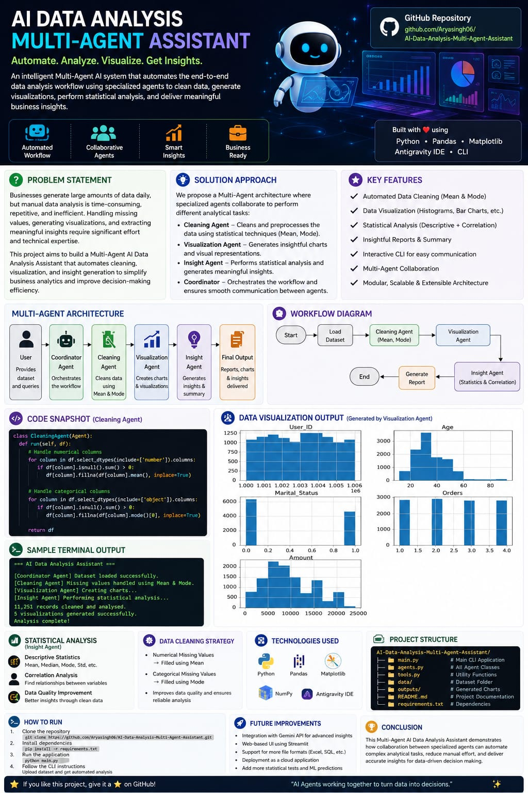
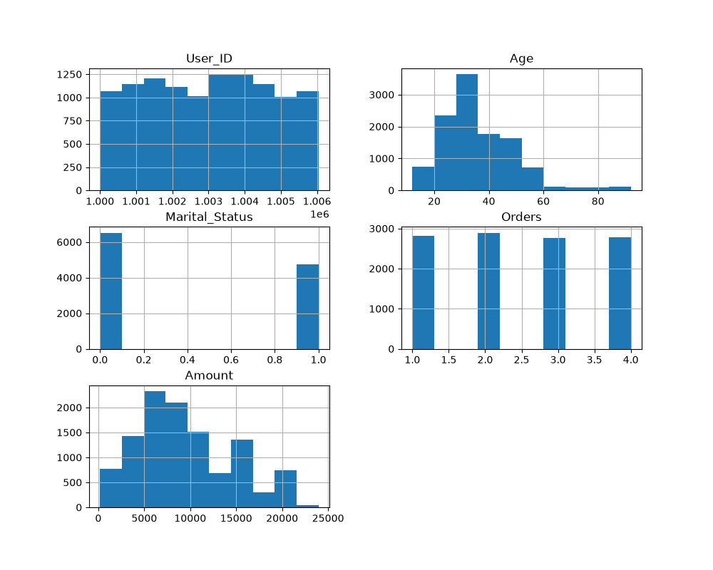
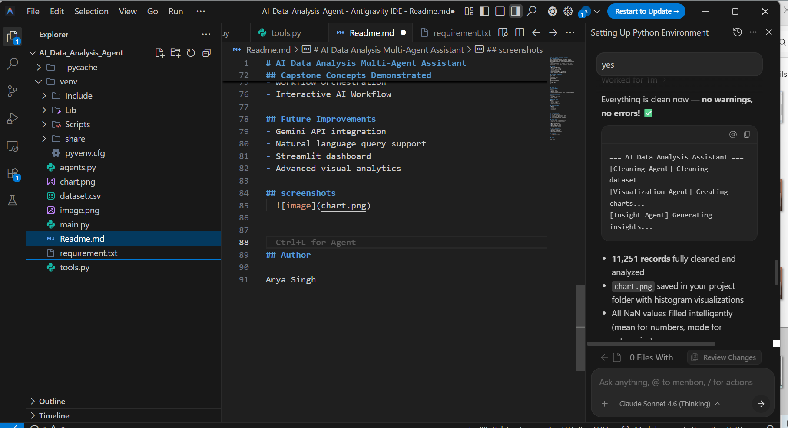

# AI Data Analysis Multi-Agent Assistant

This project is a CLI-based Multi-Agent AI Data Analysis Assistant developed as part of the Kaggle + Google 5-Day AI Agents: Intensive Vibe Coding Capstone Project. The system automates data analysis workflows using specialized AI-style agents responsible for cleaning, visualization, and insight generation.

## Project Overview
This project developed the AI Data Analysis Multi-Agent Assistant, a CLI-based multi-agent AI workflow system that automates the complete data analysis pipeline using specialized collaborative agents. The project demonstrates how multiple AI-style agents can coordinate together to preprocess data, generate visualizations, perform statistical analysis, and deliver analytical insights automatically.
This project was built as part of the Kaggle + Google 5-Day AI Agents: Intensive Vibe Coding Capstone Project using a modular agent-based architecture inspired by real-world AI workflow orchestration systems.

## Problem Statement
Businesses generate large amounts of data daily, but extracting meaningful insights often requires repetitive manual work such as cleaning datasets, handling missing values, generating visualizations, and performing statistical analysis.
This project solves this challenge by developing a Multi-Agent AI Assistant capable of automating the complete analytical workflow through collaborative specialized agents.

# Solution Approach
The system uses a modular multi-agent architecture where each agent performs a dedicated analytical task.
- Cleaning Agent → Handles missing values and preprocessing
- Visualization Agent → Generates charts and visual analytics
- Insight Agent → Produces statistical insights and reports
- Coordinator Workflow → Orchestrates communication between agents

## Features
- Multi-Agent Workflow
- Automated Data Cleaning
- Missing Value Handling
- Data Visualization
- Statistical analysis
- Descriptive analysis
- Insight Generation
- Interactive CLI-Based Query System
- Chart Generation using Matplotlib

## Multi-Agent Architecture
User Query
↓
Coordinator Agent
↓
Cleaning Agent
↓
Visualization Agent
↓
Insight Agent
↓
Final Analysis Report

## Technologies Used
- Python
- Pandas
- Matplotlib
- statistical testing
- CLI Workflow
- Antigravity IDE

## Project Workflow
1. User uploads dataset
2. Cleaning Agent preprocesses data
3. Visualization Agent creates charts
4. Insight Agent generates analytical summary
5. Final report displayed in terminal

## Sample Output
- 11,251 records cleaned and analysed
- chart.png generated successfully
  
## Capstone Concepts Demonstrated
- Multi-Agent Systems
- Agent Skills and Tools
- Workflow Orchestration
- Interactive AI Workflow

## Future Improvements
- Gemini API integration
- Natural language query support
- Streamlit dashboard
- Advanced visual analytics

## screenshots
### THUMBNAIL IMAGE
  

### OUTPUTS
  
  

## Author
Arya Singh
